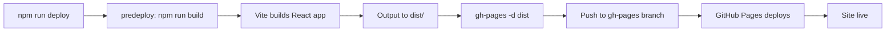

## Overview

Sociales is configured for automated deployment to GitHub Pages using the `gh-pages` package. This guide covers the complete deployment process.

## Prerequisites

- Git repository initialized
- GitHub account with repository access
- Node.js and npm installed
- Firebase configured (see [Firebase Setup](/technical/firebase-setup))

## Deployment Configuration

### Package.json Scripts

The project includes automated deployment scripts:

```json
{
  "homepage": "https://didiercolo.github.io/sociales/",
  "scripts": {
    "dev": "vite",
    "build": "vite build",
    "preview": "vite preview",
    "predeploy": "npm run build",
    "deploy": "gh-pages -d dist"
  },
  "devDependencies": {
    "gh-pages": "^6.3.0",
    "vite": "^5.1.4"
  }
}
```

### Key Configuration Points

1. **homepage** - Defines the base URL for GitHub Pages
2. **predeploy** - Automatically runs build before deployment
3. **deploy** - Publishes the `dist` folder to the `gh-pages` branch

### Vite Configuration

The `vite.config.js` sets the base path for GitHub Pages:

```javascript
import { defineConfig } from 'vite'
import react from '@vitejs/plugin-react'

export default defineConfig({
  plugins: [react()],
  base: '/sociales/',
})
```

<Warning>
The `base` path must match your repository name. If your repo is `username.github.io/my-app`, set `base: '/my-app/'`.
</Warning>

## Initial Setup

<Steps>
  <Step title="Install dependencies">
    Ensure all dependencies, including `gh-pages`, are installed:
    
    ```bash
    npm install
    ```
  </Step>

  <Step title="Update homepage in package.json">
    Replace the homepage URL with your GitHub Pages URL:
    
    ```json
    {
      "homepage": "https://YOUR_USERNAME.github.io/YOUR_REPO_NAME/"
    }
    ```
  </Step>

  <Step title="Update Vite base path">
    In `vite.config.js`, set the base to match your repository:
    
    ```javascript
    export default defineConfig({
      plugins: [react()],
      base: '/YOUR_REPO_NAME/',
    })
    ```
  </Step>

  <Step title="Configure HashRouter">
    Verify that `src/main.jsx` uses HashRouter (already configured):
    
    ```jsx
    import { HashRouter } from 'react-router-dom'
    
    ReactDOM.createRoot(document.getElementById('root')).render(
        <React.StrictMode>
            <HashRouter>
                <App />
            </HashRouter>
        </React.StrictMode>,
    )
    ```
    
    <Info>
    HashRouter is required because GitHub Pages doesn't support server-side routing. It adds a `#` to URLs but ensures direct navigation works correctly.
    </Info>
  </Step>
</Steps>

## Deploying to GitHub Pages

<Steps>
  <Step title="Build the application">
    Test the production build locally:
    
    ```bash
    npm run build
    ```
    
    This creates an optimized production build in the `dist` folder.
  </Step>

  <Step title="Preview the build">
    Verify the build works correctly:
    
    ```bash
    npm run preview
    ```
    
    Open the provided URL to test the production build locally.
  </Step>

  <Step title="Deploy to GitHub Pages">
    Run the deploy command:
    
    ```bash
    npm run deploy
    ```
    
    This command:
    - Runs `npm run build` automatically (via `predeploy`)
    - Creates or updates the `gh-pages` branch
    - Pushes the `dist` folder contents to that branch
  </Step>

  <Step title="Enable GitHub Pages">
    If this is your first deployment:
    
    1. Go to your GitHub repository
    2. Navigate to **Settings** > **Pages**
    3. Under **Source**, select **Deploy from a branch**
    4. Select **gh-pages** branch and **/ (root)** folder
    5. Click **Save**
  </Step>

  <Step title="Wait for deployment">
    GitHub Pages typically takes 1-5 minutes to deploy:
    
    - Check the **Actions** tab for deployment status
    - Once complete, your site will be live at `https://username.github.io/repo-name/`
  </Step>
</Steps>

## Deployment Workflow

The automated deployment process:



## Continuous Deployment

For automated deployments on every push, you can set up GitHub Actions:

### Create GitHub Actions Workflow

Create `.github/workflows/deploy.yml`:

```yaml
name: Deploy to GitHub Pages

on:
  push:
    branches:
      - main

jobs:
  deploy:
    runs-on: ubuntu-latest
    
    steps:
      - name: Checkout code
        uses: actions/checkout@v3
      
      - name: Setup Node.js
        uses: actions/setup-node@v3
        with:
          node-version: '18'
          cache: 'npm'
      
      - name: Install dependencies
        run: npm ci
      
      - name: Build application
        run: npm run build
      
      - name: Deploy to GitHub Pages
        uses: peaceiris/actions-gh-pages@v3
        with:
          github_token: ${{ secrets.GITHUB_TOKEN }}
          publish_dir: ./dist
```

This workflow automatically builds and deploys your app whenever you push to the `main` branch.

## Environment Variables for Production

For Firebase configuration and other secrets:

<Steps>
  <Step title="Set up repository secrets">
    1. Go to your GitHub repository
    2. Navigate to **Settings** > **Secrets and variables** > **Actions**
    3. Click **New repository secret**
    4. Add each Firebase configuration value:
       - `VITE_FIREBASE_API_KEY`
       - `VITE_FIREBASE_AUTH_DOMAIN`
       - `VITE_FIREBASE_PROJECT_ID`
       - etc.
  </Step>

  <Step title="Update GitHub Actions workflow">
    Modify the workflow to use secrets:
    
    ```yaml
    - name: Build application
      env:
        VITE_FIREBASE_API_KEY: ${{ secrets.VITE_FIREBASE_API_KEY }}
        VITE_FIREBASE_AUTH_DOMAIN: ${{ secrets.VITE_FIREBASE_AUTH_DOMAIN }}
        VITE_FIREBASE_PROJECT_ID: ${{ secrets.VITE_FIREBASE_PROJECT_ID }}
        VITE_FIREBASE_STORAGE_BUCKET: ${{ secrets.VITE_FIREBASE_STORAGE_BUCKET }}
        VITE_FIREBASE_MESSAGING_SENDER_ID: ${{ secrets.VITE_FIREBASE_MESSAGING_SENDER_ID }}
        VITE_FIREBASE_APP_ID: ${{ secrets.VITE_FIREBASE_APP_ID }}
        VITE_FIREBASE_MEASUREMENT_ID: ${{ secrets.VITE_FIREBASE_MEASUREMENT_ID }}
      run: npm run build
    ```
  </Step>
</Steps>

<Warning>
**Never commit environment variables or Firebase credentials to your repository!** Always use GitHub Secrets for sensitive data.
</Warning>

## Troubleshooting

### Blank page after deployment

**Cause:** Base path mismatch

**Solution:**
1. Verify `base` in `vite.config.js` matches your repo name
2. Check `homepage` in `package.json` is correct
3. Rebuild and redeploy: `npm run deploy`

### 404 errors on page refresh

**Cause:** GitHub Pages doesn't support client-side routing

**Solution:** Ensure you're using `HashRouter` instead of `BrowserRouter` in `src/main.jsx`.

### Assets not loading

**Cause:** Incorrect base path for assets

**Solution:**
1. Check that `base: '/your-repo/'` is set in `vite.config.js`
2. Ensure the base path ends with a `/`
3. Rebuild: `npm run build && npm run deploy`

### Firebase authentication not working in production

**Cause:** Domain not authorized in Firebase

**Solution:**
1. Go to Firebase Console > Authentication > Settings
2. Add `username.github.io` to **Authorized domains**
3. Wait a few minutes for changes to propagate

### "gh-pages not found" error

**Cause:** Package not installed

**Solution:**
```bash
npm install --save-dev gh-pages
npm run deploy
```

## Manual Deployment

If you prefer manual control:

<Steps>
  <Step title="Build the application">
    ```bash
    npm run build
    ```
  </Step>

  <Step title="Create gh-pages branch">
    ```bash
    git checkout -b gh-pages
    ```
  </Step>

  <Step title="Copy dist contents to root">
    ```bash
    cp -r dist/* .
    ```
  </Step>

  <Step title="Commit and push">
    ```bash
    git add .
    git commit -m "Deploy to GitHub Pages"
    git push origin gh-pages
    ```
  </Step>
</Steps>

<Info>
Using `npm run deploy` is recommended as it handles all these steps automatically.
</Info>

## Deployment Checklist

Before deploying to production:

- [ ] Firebase configuration is correct and uses environment variables
- [ ] All authorized domains are added in Firebase Console
- [ ] `homepage` in `package.json` matches your GitHub Pages URL
- [ ] `base` in `vite.config.js` matches your repository name
- [ ] HashRouter is used for routing
- [ ] Application builds successfully: `npm run build`
- [ ] Preview works correctly: `npm run preview`
- [ ] No sensitive data committed to repository
- [ ] GitHub Pages is enabled in repository settings

## Monitoring Deployments

### GitHub Actions

If using automated deployments:
1. Go to the **Actions** tab in your repository
2. View deployment logs for each workflow run
3. Check for errors or warnings

### GitHub Pages Status

1. Go to **Settings** > **Pages**
2. View the current deployment status
3. See the live URL and last deployment time

## Next Steps

- [Configure Firebase authentication](/technical/firebase-setup)
- [Review the technical architecture](/technical/architecture)
- Set up custom domain (optional)
- Configure Google Analytics for usage tracking
